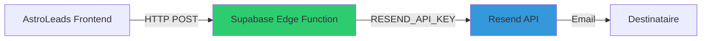

# Configuration Resend pour AstroLeads

Ce guide vous explique comment configurer Resend pour activer l'envoi d'emails dans AstroLeads.

## Pourquoi Resend ?

Resend est un service d'envoi d'emails transactionnels qui permet d'envoyer vos cold emails de campagne. Sans Resend configuré, vous verrez l'erreur **"Failed to fetch"** lors de l'envoi d'emails.

## Étape 1: Créer un Compte Resend

1. Allez sur [resend.com](https://resend.com)
2. Créez un compte gratuit
3. Vérifiez votre email

## Étape 2: Obtenir une Clé API

1. Connectez-vous à votre dashboard Resend
2. Allez dans **API Keys** (menu de gauche)
3. Cliquez sur **Create API Key**
4. Donnez un nom (ex: "AstroLeads Production")
5. Sélectionnez les permissions: **Sending access**
6. Cliquez sur **Add**
7. **Copiez la clé** (commence par `re_`) - elle ne sera affichée qu'une seule fois!

## Étape 3: Configurer la Clé dans Supabase

### Via Supabase Dashboard (Recommandé)

1. Allez sur [supabase.com/dashboard](https://supabase.com/dashboard)
2. Sélectionnez votre projet AstroLeads
3. Dans le menu de gauche, allez dans **Edge Functions**
4. Cliquez sur l'onglet **Secrets**
5. Cliquez sur **Add new secret**
6. Remplissez:
   - **Name:** `RESEND_API_KEY`
   - **Value:** Votre clé API Resend (ex: `re_abc123...`)
7. Cliquez sur **Save**

### Via Supabase CLI (Alternatif)

```bash
# Installer Supabase CLI si nécessaire
npm install -g supabase

# Se connecter
supabase login

# Lier votre projet
supabase link --project-ref votre-project-id

# Ajouter le secret
supabase secrets set RESEND_API_KEY=re_votre_cle_ici
```

## Étape 4: Configurer le Mode Test (Important!)

⚠️ **Le plan gratuit de Resend ne permet d'envoyer QU'À des emails vérifiés!**

Pour tester sans limites:

1. Dans AstroLeads, allez dans **Paramètres**
2. Activez le **Mode Test Email** (toggle bleu)
3. Entrez votre email vérifié sur Resend dans le champ **Email de Test**
4. Cliquez sur **Sauvegarder les paramètres**

En mode test, tous les emails seront redirigés vers votre email de test au lieu des vrais destinataires.

## Étape 5: Vérifier un Email sur Resend (Pour le Mode Test)

1. Dans votre dashboard Resend, allez dans **Domains**
2. Pour tester rapidement:
   - Vous pouvez utiliser `onboarding@resend.dev` (fourni par défaut)
   - Ou ajouter votre propre domaine pour un usage en production

## Étape 6: Tester l'Envoi

1. Dans AstroLeads, créez ou ouvrez une campagne
2. Cliquez sur **Envoyer Campagne** ou **Actions en Temps Réel**
3. L'email devrait s'envoyer sans erreur "Failed to fetch"
4. Vérifiez votre boîte de réception (l'email de test configuré)

## Déploiement en Production

Pour envoyer à de vrais destinataires (pas en mode test):

### Option 1: Vérifier un Domaine (Recommandé)

1. Dans Resend Dashboard → **Domains**
2. Cliquez sur **Add Domain**
3. Entrez votre domaine (ex: `votreentreprise.com`)
4. Ajoutez les enregistrements DNS fournis
5. Une fois vérifié, configurez le `from` email dans vos campagnes (ex: `contact@votreentreprise.com`)

### Option 2: Upgrader à un Plan Payant

Le plan payant Resend permet plus de flexibilité sur les domaines.

## Dépannage

### Erreur: "Failed to fetch"

✅ **Solutions:**
- Vérifiez que `RESEND_API_KEY` est configurée dans Supabase Edge Functions Secrets
- Redéployez vos Edge Functions après avoir ajouté le secret
- Vérifiez que la clé API est valide sur resend.com

### Erreur: "Invalid recipient"

✅ **Solutions:**
- Activez le **Mode Test** dans Paramètres
- Ou vérifiez votre domaine sur Resend

### Erreur: "Missing RESEND_API_KEY"

✅ **Solutions:**
- La clé n'est pas configurée dans Supabase
- Suivez l'Étape 3 ci-dessus

## Architecture Technique



1. **Frontend** envoie une requête à `/functions/v1/send-email`
2. **Edge Function** utilise `RESEND_API_KEY` depuis les secrets Supabase
3. **Resend API** envoie l'email au destinataire

## Support

- [Documentation Resend](https://resend.com/docs)
- [Documentation Supabase Edge Functions](https://supabase.com/docs/guides/functions)
- [AstroLeads GitHub Issues](https://github.com/zakibelm/Astroleadsv2.0/issues)
